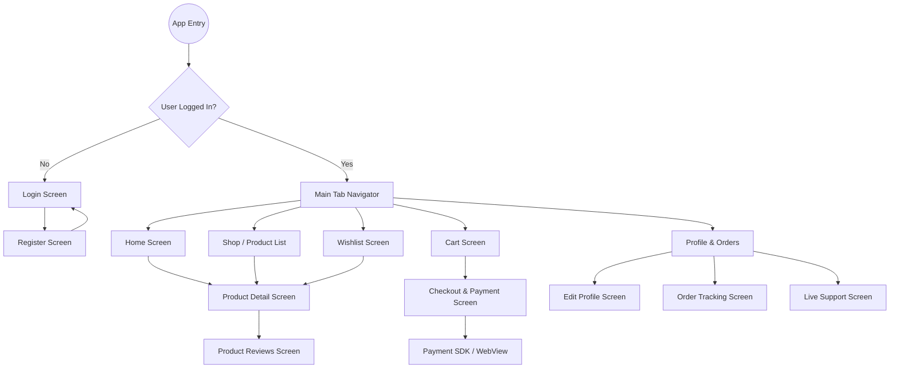

# Mobile App Specification & Design Guidelines (Vanguard Clothing E-Commerce)

This document contains a comprehensive design and functional specification for the Vanguard Clothing E-Commerce mobile application. It covers all user-facing client routes (`/` routes), completely excluding administrative features. This spec is formatted so that any autonomous AI agent or mobile developer can build the entire client-facing application from scratch.

---

## 📱 Tech Stack Mapping (Web to Expo Mobile)

To maintain technology alignment and ease code migration, the mobile app uses the exact same stack from the web application, mapped to their React Native & Expo equivalents:

| Web Technology (Package) | Mobile Equivalent (Expo / React Native) | Usage / Context |
| :--- | :--- | :--- |
| **Next.js** (App Router) | **Expo Router** (File-based Routing) | Screen structure matching Web folder hierarchy |
| **Tailwind CSS v4** | **NativeWind v4/v5** | Universal Tailwind styling for React Native components |
| **Zustand** (`zustand`) | **Zustand** (`zustand`) | Shared global store logic (Cart state, Auth session) |
| **TanStack Query** (`@tanstack/react-query`) | **TanStack Query** (`@tanstack/react-query`) | API caching, pagination, and data-fetching hooks |
| **Axios** (`axios`) | **Axios** (`axios`) | Request handler for all REST API endpoints |
| **Socket.io Client** (`socket.io-client`) | **Socket.io Client** (`socket.io-client`) | Live Support real-time messaging pipeline |
| **React Hook Form** + **Zod** | **React Hook Form** + **Zod** | Client forms & input schemas (Auth & Shipping) |
| **Lucide Icons** (`lucide-react`) | **Lucide Icons** (`lucide-react-native`) | Visual interface icons |
| **Framer Motion** | **Moti** / **React Native Reanimated** | Fluid animations and page transitions |
| **Swiper** | **react-native-reanimated-carousel** | Product details & Hero banner image sliders |
| **Sonner** / **SweetAlert2** | **react-native-flash-message** | Premium micro-toasts and notifications |

---

## 🎨 Global Design System & Aesthetics

To maintain a premium, state-of-the-art feel, the app must strictly follow these design aesthetics:

* **Theme & Colors:**
  * **Primary (Accent):** Pitch Black (`#0F0F11`) / Crisp White (`#FFFFFF`)
  * **Secondary:** Cool Slate (`#64748B`), Light Gray (`#F1F5F9`)
  * **Accents:** Muted Gold (`#D4AF37`) or Crimson Red (`#EF4444`) for sale indicators.
  * **Backgrounds:** Smooth, low-contrast gradient backgrounds or clean pure white (`#FFFFFF`) in light mode and deep charcoal (`#09090B`) in dark mode.
* **Typography:**
  * Modern sans-serif (e.g., *Inter*, *Outfit*, or *Roboto*).
  * Clear hierarchy: Headers should use semi-bold/bold weights, body text should be highly readable.
* **Interactions & Animations:**
  * Micro-interactions: Subtle scale-down effect on pressing buttons/cards.
  * Smooth transitions between screens (slide or shared element transitions).
  * Shimmer effects for all skeleton loading states.

---

## ⚡ Dynamic Home Layout Builder (Backend Integration)

The backend exposes a home layout configuration API via `GET /api/home-layout`. The Expo app can fully parse and render this dynamically, meaning any layout changes made via the admin builder will reflect in the mobile app instantly without requiring app store updates.

### Dynamic Renderer Architecture:
In the home screen entry file (`app/(tabs)/index.jsx`), you will fetch the active layout sections list, filter `isVisible: true`, and loop through them using a dynamic layout mapper:

```javascript
// Example in Expo (Home Screen)
export default function HomeScreen() {
  const { data: layoutData } = useQuery(['homeLayout'], fetchHomeLayout);
 
  const renderSection = (section) => {
    switch (section.type) {
      case 'HERO':
        return <MobileHeroSlider config={section.config} />;
      case 'USP':
        return <MobileUspCards config={section.config} />;
      case 'FLASH_SALE':
        return <MobileFlashSale config={section.config} />;
      case 'CATEGORY_GRID':
        return <MobileCategoryGrid config={section.config} />;
      case 'FEATURED_PRODUCTS':
        return <MobileProductGrid config={section.config} type="featured" />;
      default:
        return null;
    }
  };

  return (
    <ScrollView className="bg-background">
      {layoutData?.sections?.filter(s => s.isVisible).map(renderSection)}
    </ScrollView>
  );
}
```

---

## 🎨 Centralized CSS & Tailwind (NativeWind global.css)

Yes, you can have a single entry point for styling just like your web `global.css`. With **NativeWind v4/v5**, you write standard CSS variables, themes, and utility layers.

### Setup Architecture:
1. Create a `global.css` at the root of your Expo project.
2. Define custom color properties (`--primary`, `--background`, `--card`, etc.) matching your web configurations:

```css
/* mobile/global.css */
@import "tailwindcss";

:root {
  --background: #FFFFFF;
  --foreground: #141414;
  --primary: #0F0F11;
  --card: #FFFFFF;
  --border: #E2E8F0;
}

.dark {
  --background: #09090B;
  --foreground: #F9FAFB;
  --primary: #FFFFFF;
  --card: #151518;
  --border: #27272A;
}
 
@layer base {
  .glass {
    background-color: rgba(255, 255, 255, 0.3);
    border-color: rgba(255, 255, 255, 0.1);
  }
}
```

3. Import `global.css` inside the root `app/_layout.jsx` of your Expo Router:
```javascript
import "@/global.css";

export default function RootLayout() {
  return <Stack />;
}
```

This centralizes all styling assets, enabling the use of semantic tokens like `className="bg-background text-foreground border-border"` universally across Android, iOS, and Web.

---

## 📂 Expo File Structure Mapping (Mirroring Web)

To make context switching effortless, the Expo app mirrors the web application's structure. Here is how your **Next.js Web** directories map directly to **Expo Mobile**:

```text
web/src/                        mobile/
├── app/                        ├── app/
│   ├── layout.js               │   ├── _layout.jsx             # Global providers & CSS entry
│   ├── page.js                 │   ├── (tabs)/                 # Main bottom tab navigations
│   │                           │   │   ├── index.jsx           # Home Screen (Page.js equivalent)
│   │                           │   │   ├── shop.jsx            # Shop Listing Screen
│   │                           │   │   ├── wishlist.jsx        # Saved items Screen
│   │                           │   │   ├── cart.jsx            # Cart Screen
│   │                           │   │   └── profile.jsx         # Profile Screen
│   │                           │   │
│   │                           │   ├── (auth)/                 # Auth route group
│   │                           │   │   ├── login.jsx           # Login Screen
│   │                           │   │   └── register.jsx        # Register Screen
│   │                           │   │
│   │                           │   ├── product/                # Product sub-routes
│   │                           │   │   └── [slug].jsx          # Product Detail Screen
│   │                           │   │
│   │                           │   ├── checkout/               # Order fulfillment routes
│   │                           │   │   ├── index.jsx           # Shipping Address & Form
│   │                           │   │   └── payment.jsx         # In-app WebView for payment gateways
│   │                           │   │
│   │                           │   ├── order/
│   │                           │   │   └── track.jsx           # Live Order Tracking Timeline
│   │                           │   │
│   │                           │   └── support/
│   │                           │       └── chat.jsx            # Socket.io Support Chat Screen
│   │                           │
│   ├── globals.css             │   ├── global.css              # Central styling configurations
│  
├── components/                 ├── components/                 # Shared UI elements, loaders, and headers
├── hooks/                      ├── hooks/                      # Custom hooks, API query functions
├── lib/                        ├── lib/                        # Axios clients, base API settings
├── store/                      ├── store/                      # Zustand state store configurations
└── utils/                      └── utils/                      # Formatting, typography, global vars
```

---

## 🗺️ Navigation & Route Structure

The app uses a main **Tab Navigator** for core features, supplemented by **Stack Navigators** for detail screens.



---

## 📑 Screen-by-Screen Detailed Specifications

### 1. Authentication Screens (Login & Register)
* **API Endpoints:**
  * `POST /api/auth/register` (Register user)
  * `POST /api/auth/login` (Authenticate and retrieve JWT)
* **UI & Layout:**
  * Clean, minimal hero illustration or logo branding at the top.
  * Form inputs with float-label behavior: Full Name (register only), Email, Phone, Password.
  * Primary action button with a premium ripple effect.
  * Social login options (Google/Apple) at the bottom.
  * "Forgot Password" and "Toggle View" (Login <-> Register) links.
* **State Management:**
  * Securely save the received JWT token to secure storage (e.g., `Expo SecureStore` or `Flutter Secure Storage`).

---

### 2. Home Screen
* **API Endpoints:**
  * `GET /api/settings` (Site brand settings, logo, theme colors)
  * `GET /api/home-layout` (Dynamic layout sections)
* **UI & Layout:**
  * **Header:** Minimal bar with logo, Search icon, and Notification icon.
  * **Dynamic Sections (loaded dynamically based on configuration):**
    1. **HERO / BANNER_SLIDER:** A horizontal page-swipe banner with promo texts and background images.
    2. **USP Section:** Horizontal cards showing trust badges (e.g., "Free Shipping", "Secure Payment").
    3. **CATEGORY_GRID:** 4-6 round items displaying core product categories.
    4. **FLASH_SALE:** Urgency card featuring a live countdown timer and product items with sale badges.
    5. **FEATURED_PRODUCTS & NEW_ARRIVALS:** Horizontal scroll lists displaying elegant product cards.
    6. **PROMO_BANNER:** Single large banner showing ongoing seasonal discounts.
* **Interactions:**
  * Tapping a product card navigates to the **Product Detail Screen**.
  * Tapping a category navigates to the **Shop Screen** pre-filtered by that category.

---

### 3. Shop & Search Screen (Product Catalog)
* **API Endpoints:**
  * `GET /api/products` (Accepts queries: `category`, `subcategory`, `search`, `minPrice`, `maxPrice`, `sort`, `page`, `limit`)
  * `GET /api/categories` (Fetch list of categories & subcategories)
* **UI & Layout:**
  * **Top Bar:** Interactive search field with instant search debouncing.
  * **Filter Pill Bar:** Horizontal scrollable pills for categories.
  * **Filter Modal:** Bottom drawer containing a price range slider, sort options (Latest, Price: Low to High, Price: High to Low), and subcategory checkboxes.
  * **Product Grid:** Two-column clean grid displaying:
    * High-quality main image.
    * Discount tag (if applicable).
    * Product Name & Brand.
    * Current Price & original crossed-out price.
    * Wishlist heart icon overlay.
* **Pagination:**
  * Infinite scroll (lazy loading) with a bottom spinner indicator.

---

### 4. Product Detail Screen
* **API Endpoints:**
  * `GET /api/products/details/:slug` (Retrieve complete product information)
  * `GET /api/reviews/:productId` (Fetch reviews & ratings)
* **UI & Layout:**
  * **Image Gallery:** Multi-image full-width horizontal swiper with index indicator (e.g. 1/3).
  * **Product Info:** Large product name, badge, price, discount amount, and star rating.
  * **Size Selector:** Elegant horizontal pill choices with size status (available/out of stock).
  * **Description Accordion:** Expandable section outlining description details, fabric, and washing instructions.
  * **Reviews Preview:** List showing customer reviews, comments, and star ratings.
  * **Sticky Bottom Panel:** Split actions: Add to Wishlist (heart icon) and "Add to Cart" (wide primary button).
* **Validation & Edge Cases:**
  * Disable "Add to Cart" if no size is selected, or if the selected size is out of stock.

---

### 5. Shopping Cart Screen
* **API Endpoints:**
  * `GET /api/cart` (If authenticated, otherwise manage locally using persistence storage)
  * `POST /api/coupons/validate` (Check discount code)
* **UI & Layout:**
  * **Cart List:** Vertical list of selected items.
    * Product Image, Name, Selected Size, Price.
    * Counter buttons (`+` / `-`) to easily update quantities.
    * Delete button (Trash icon) to remove the item.
  * **Promo Coupon Section:** Input field with an "Apply" button to add dynamic discount rates.
  * **Price Summary:** Display Subtotal, Applied Discount, Shipping Fee, and Grand Total.
  * **Primary Action:** Solid "Proceed to Checkout" button.
* **Edge Cases:**
  * Empty cart state showing a custom illustration and a "Start Shopping" button.

---

### 6. Checkout & Payment Screen
* **API Endpoints:**
  * `POST /api/orders` (Submit new order)
  * Payment verification webhooks / endpoints for bKash & SSLCommerz.
* **UI & Layout:**
  * **Shipping Form:** Input fields for Name, Phone Number, City, Area, Detailed Address, and Zip Code.
  * **Order Summary Panel:** Small list summarizing order items and total cost.
  * **Payment Method Selector:** Rounded radio choices:
    * Cash on Delivery (COD)
    * bKash / MFS (redirects to gateway/webview)
    * Cards / Online Banking (redirects to SSLCommerz gateway/webview)
  * **Primary Action:** "Place Order" button.
* **Workflow:**
  * If online payment is chosen, open a secure in-app WebView rendering the gateway response. On success, navigate to the Order Confirmation page.

---

### 7. User Profile & Order History Screen
* **API Endpoints:**
  * `GET /api/users/profile` (Retrieve logged-in user profile details)
  * `GET /api/orders` (List user's past and current orders)
* **UI & Layout:**
  * **User Card:** Avatar image, full name, email, and phone number with an "Edit Profile" shortcut.
  * **Order History Section:** Tabs sorting orders by status (Active / Completed).
    * Each order item shows: Order ID, Date, Total Item Count, Grand Total, and a colorful status badge.
    * "Track Order" button next to active orders.
  * **Quick Links:** Address Book, Notifications Toggle, Support Chat, and a red-themed "Logout" button.

---

### 8. Order Tracking Screen
* **API Endpoints:**
  * `GET /api/orders/track/:orderId` (Get live status transitions)
* **UI & Layout:**
  * **Summary:** Show Order ID, placement date, and expected delivery date.
  * **Timeline Tracker:** Vertical progress steps highlighting current location:
    * `[x] Order Placed`
    * `[x] Processing / Confirmed`
    * `[ ] Shipped / Out for Delivery`
    * `[ ] Delivered`
  * Each active step changes color (e.g. gray to gold/black) and shows timestamps.

---

### 9. Wishlist Screen
* **API Endpoints:**
  * `GET /api/wishlist` (Fetch favorite products)
* **UI & Layout:**
  * List display similar to the Shop grid layout.
  * Easy two-column grid.
  * Add a quick "Add to Cart" icon button overlay.
  * Delete icon overlay to easily remove the item from favorites.

---

### 10. Live Support Chat Screen
* **API Endpoints / Real-time connection:**
  * Socket.io connection using `io(backend_url)`
  * `GET /api/chat/history` (Retrieve past messages)
* **UI & Layout:**
  * Dynamic Messenger layout.
  * Messages displayed inside chat bubbles (Right bubble: User, Left bubble: Admin Support).
  * Auto-scrolling list that snaps to the newest message.
  * Bottom input field with a send icon, supporting text and image attachment.

---

### 11. Blog & Articles Screen
* **API Endpoints:**
  * `GET /api/blogs` (Fetch all blogs/articles)
  * `GET /api/blogs/:slug` (Get full blog content)
* **UI & Layout:**
  * List of articles featuring banner thumbnails, publish date, author, title, and excerpt.
  * Tapping an article loads a clean typography page reading the full Markdown/HTML contents.

---

## ⚡ Global API Error Handling & Network Offline States

* **Network Checker:** Integrate a listener to show an elegant banner at the top of the screen if connection drops ("No internet connection. Retrying...").
* **Error Modals:** Catch `401 Unauthorized` responses and automatically log the user out, sending them to the Login Screen with a Toast reminder.
* **Skeleton Loaders:** Place beautifully animated layout shapes during API calls to ensure zero layout-shifts.

---

## 🚀 Advanced Web Features to Replicate in Expo

These core features exist in the web application (`/` routes) and **must** be implemented in the Expo mobile app to ensure feature parity and full sync with the backend services:

### 1. Unified Event Tracking & Server-Side CAPI
The web app utilizes a universal tracking manager (`web/src/lib/tracking/tracker.js`) to dispatch e-commerce events (`ViewContent`, `AddToCart`, `InitiateCheckout`, `Purchase`) to multiple client pixels (Meta Pixel, Google Tag Manager, TikTok Pixel, Snapchat, Pinterest) and to the server-side **Conversions API (CAPI)** via the `/api/track` route.
* **Expo Implementation:**
  * Create a global `tracking` utility in `lib/tracker.js`.
  * Dispatch actions to the server-side endpoint `/api/track` whenever a user views products, adds to cart, initiates checkout, or completes payment.
  * Optionally integrate `react-native-fbsdk-next` or Google Analytics for Firebase if client-side mobile SDK pixels are required.

### 2. Dynamic Brand Identity Theme Matrix
The web layout adapts themes dynamically (e.g., `executive`, `streetwear`, `vintage`, `modern`) loaded from backend settings (`branding.activeTheme`).
* **Expo Implementation:**
  * Define styling variables for each brand theme in your `global.css` file.
  * Read `branding.activeTheme` from the backend settings API (`GET /api/settings`).
  * Apply class names dynamically using your layout resolver to change visual styles based on the active theme.

### 3. Payment Callback Return Handlers (Success & Failure Pages)
The checkout system redirects users to `/payment/success` or `/payment/failed` upon completing transactions.
* **Expo Implementation:**
  * Add in-app WebView return URL listeners.
  * If the WebView loads the success callback URL, capture the query parameters (e.g. `orderId`, `transactionId`), close the WebView, and navigate the user to `app/checkout/success.jsx` (which renders an order summary, payment details, and invoice).
  * If it loads the failed callback URL, redirect to `app/checkout/failed.jsx` with an error message and a retry button.

### 4. App Maintenance Mode
The backend controls maintenance access via `settings.config.maintenanceMode`.
* **Expo Implementation:**
  * Fetch application settings on launch.
  * If `maintenanceMode` is true, block navigation and display a full-screen "Maintenance Mode" status page with a retry button.

### 5. Multi-Language / Bangla (i18n) Support
The backend and web applications support bilingual configurations (English & Bangla).
* **Expo Implementation:**
  * Define localized translation files (e.g., in `src/utils/typography/` similar to the web application) containing keys for English and Bangla.
  * Use Zustand to manage the global language state, loading the default language preference from the API branding settings (`GET /api/settings` -> `branding.defaultLanguage`) or standard device locale if not set, and storing the user's preference using `AsyncStorage`.
  * Support dynamic translation of backend-driven content by rendering Bangla fields (e.g., `section.titleBn`, `section.subtitleBn`, `product.nameBn`) when the selected language is set to Bangla (`bn`).
  * Add a language toggle switcher in the User Profile / settings screen to allow users to switch between English and Bangla seamlessly.